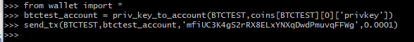
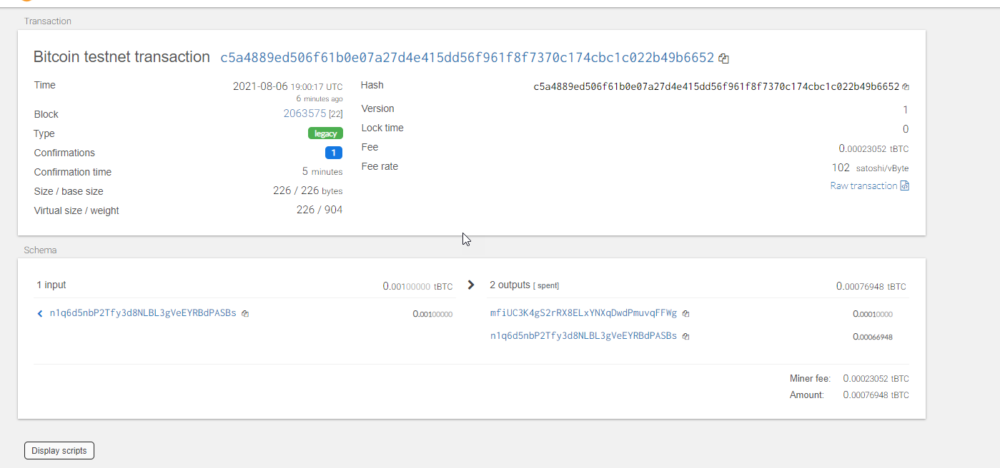
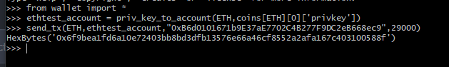
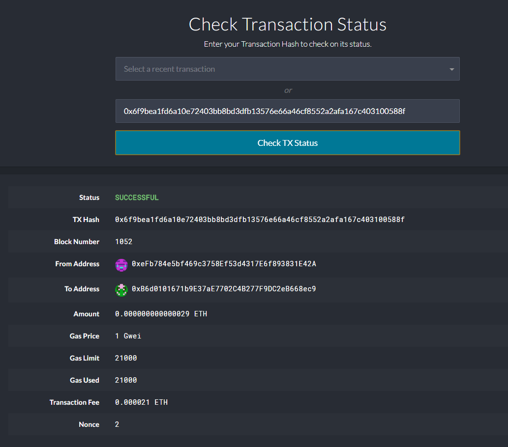

Your new startup is focusing on building a portfolio management system that supports not only traditional assets
like gold, silver, stocks, etc, but crypto-assets as well! The problem is, there are so many coins out there! It's
a good thing you understand how HD wallets work, since you'll need to build out a system that can create them.
You're in a race to get to the market. There aren't as many tools available in Python for this sort of thing, yet.
Thankfully, you've found a command line tool, hd-wallet-derive that supports not only BIP32, BIP39, and BIP44, but
also supports non-standard derivation paths for the most popular wallets out there today! However, you need to integrate
the script into your backend with your dear old friend, Python.
Once you've integrated this "universal" wallet, you can begin to manage billions of addresses across 300+ coins, giving
you a serious edge against the competition.
In this assignment, however, you will only need to get 2 coins working: Ethereum and Bitcoin Testnet.
Ethereum keys are the same format on any network, so the Ethereum keys should work with your custom networks or testnets.


# Requirements
Follow the instructions to set up the environment:  [Instructions ](https://github.com/xfdobs/Multi-Blockchain-Wallet-in-Python/blob/main/Instuctions%20_requirements.md)

Python dependencies - Run the command below from the project folder:

```sh
  pip install -r requirements.txt
```
This command will install the dependencies from the text file.


# Transactions instructions:

## BTC - BTCTEST
Instruction to send BTC transactions using the btc test net.
* Load the 12 words mnemonic in the enviroment file (.env). It will be used to generate the keys later
* Run the python terminal from the source project folder and import the wallet script (see the pic below)
* Load the the account address based on the coin that you want, calling the function "priv_key_to_account". In this example, we'll use BTCTEST   
* Send the transaction calling the function "send_txt" providing the account that will receive the funds and the amount.
* You can check the transaction in the website https://tbtc.bitaps.com/
   

#####  Confirmation:

   

#


# ETH - ETHEREUM

* Load the 12 words mnemonic in the enviroment file (.env). It will be needed to generate the keys later
* Update the <networkname>.json ( in the GoEthereum installation) with the ETH address from the "coins" dictionary in the wallet.py.
* Delete the geth folder in each node, then re-initialize using:  ```sh geth --datadir <node name> init networkname.json ``` . This will create a new chain, and will pre-fund the new account.
* Run the Node in order to be able to start mining.  ```sh ./geth --datadir <node name> --mine --minerthreads 1```
* Update the chainID in the function "create_tx" with your local chainId when you created the genesis.
* Run the python terminal from the source project folder and import the wallet script (see the pic below)
* Load the the account address based on the coin that you want, calling the function "priv_key_to_account". In this example, we'll use ETH
* Send the transaction calling the function "send_txt" providing the account that will receive the funds and the amount.
* You need to use MyCrypto and you'll need the transaction hash to check the status of the transaction.
   

#####  Confirmation:

   
